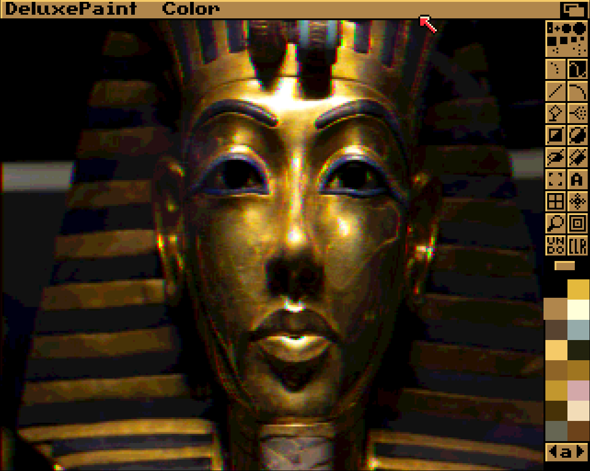

# PHP JPEG/PNG to Amiga IFF ILBM Converter

Convert modern image formats (JPEG, PNG) to the classic Amiga IFF ILBM format. This tool provides a simple way to create IFF images compatible with Amiga computers and emulators.

---

## Why?

Why not? This tool lets you create images for a legendary computer system, the Commodore Amiga, just because you can. While plenty of tools can view or open IFF/ILBM files, very few actually let you create them.

Also, I was curious to see if it’s even possible to write such a tool in a language such as PHP. This project is a way to test those limits, relive some nostalgia, and celebrate the creative quirks of the Amiga graphics legacy.

---

### HAM Artifacts

The **[Hold-And-Modify (HAM)](https://en.wikipedia.org/wiki/Hold-And-Modify)** mode is iconic to the Amiga, but it comes with its quirks. HAM6 only allows 16 base colors and relies on modifying the previous pixel’s color to create a high-color effect. This can lead to noticeable color fringing, particularly along horizontal scanlines where sharp contrasts meet. 

For example, in images with large horizontal gradients or sharp color transitions—such as where a yellow car body meets black text—HAM may require intermediate pixels to approximate the desired color. The result is a "color fringing" artifact that is characteristic of HAM6's limitations.

I actually enjoy seeing these artifacts, especially on modern Retina-powered MacBooks. Yes, it’s nerdy and geeky but it is fascinating to see the creative constraints of a 1990s computer system juxtaposed with today’s high-resolution displays!

---

### **HAM6 Demonstration in Deluxe Paint IV**

We converted a JPEG image to **HAM6** using this tool and opened it in **Deluxe Paint IV** to validate compatibility.

#### **Screenshot**  


This confirms the tool produces authentic HAM6 images, complete with classic color fringing effects.

---

## Experimental Support for ECS Compatibility

This tool includes **experimental support for generating IFF images fully compatible with the [Amiga Enhanced Chip Set (ECS)](https://en.wikipedia.org/wiki/Amiga_Enhanced_Chip_Set)**. When using the `--chipset=ECS` option, the following features are applied:

1. **12-bit Palette**: Colors are clamped to the Amiga's **12-bit RGB color space (0–15 per channel)**, ensuring that all colors fit within the ECS's hardware limits.
2. **32 Colors Maximum**: The number of simultaneous colors is limited to 32, as allowed by the ECS chipset in standard display modes.
3. **Supported Resolutions**: Use PAL (320×256) or NTSC (320×200) resolutions for full compatibility.

---

### **ECS-Compatible Usage**

```bash
php iff_convertor.php --input=input.jpg --output=output_ecs.iff --width=320 --height=256 --colors=32 --chipset=ECS --dither=true --compress=true
```

---

### **Example of ECS Image Generation**

To create a fully ECS-compatible image with the following characteristics:
- **Resolution**: 320×256 (PAL)
- **Colors**: 32
- **Dithering**: Enabled
- **Compression**: Enabled

Run this command:
```bash
php iff_convertor.php --input=sample_image.jpg --output=sample_ecs.iff --width=320 --height=256 --colors=32 --chipset=ECS --dither=true --compress=true
```

---

### Notes

1. The generated images are tested on modern emulators (e.g., **FS-UAE**, **WinUAE**) and should display correctly on original ECS hardware.
2. Stick to **standard Amiga resolutions** (e.g., **320×256 PAL** or **320×200 NTSC**) for best results.

---

## Quick Start

```bash
# Basic conversion with default settings
php iff_convertor.php --input=input.jpg --output=output.iff

# Create a standard image with size and colors (e.g., 320x200, 16 colors, no dither)
php iff_convertor.php --input=input.jpg --output=output.iff --width=320 --height=200 --colors=16 --dither=false --compress=true

# Generate a HAM6 image (e.g., 320x256)
php iff_convertor.php --input=input.jpg --output=output_ham6.iff --width=320 --height=256 --ham=true --compress=true

# Generate an ECS-compatible image (e.g., 320x256, 12-bit RGB palette)
php iff_convertor.php --input=input.jpg --output=output_ecs.iff --width=320 --height=256 --colors=32 --chipset=ECS --dither=true --compress=true
```

---

## Features

- Convert JPEG/PNG to IFF ILBM
- Optional image resizing
- Configurable color palettes (2–256 colors)
- Hold-And-Modify (HAM6) support for classic Amiga chipsets
- **Experimental ECS support for 12-bit RGB and 32 colors**
- ByteRun1 compression support
- Works with PAL and NTSC resolutions

---

### Technical Details

#### IFF ILBM Format
The converter generates standard IFF ILBM files with:
- **FORM** container
- **BMHD** (Bitmap Header) chunk
- **CMAP** (Color Map) chunk
- **BODY** (Bitmap Data) chunk

#### ECS Mode
When `--chipset=ECS` is specified:
- All colors are clamped to the **12-bit ECS palette (4096 colors)**.
- The palette is limited to **32 simultaneous colors**.
- Standard Amiga resolutions are recommended (e.g., 320×256 for PAL).
